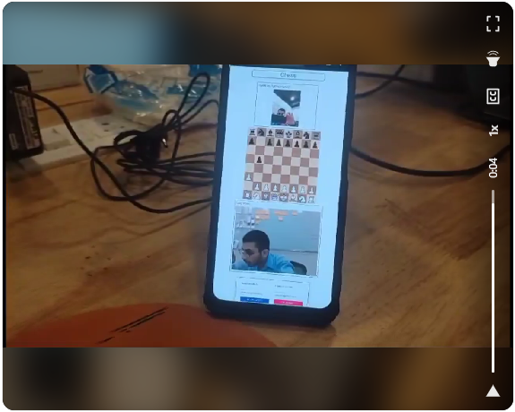

# TeleChess | Play Chess on Video Call
TeleChess is a web app that allows users to play chess with friends over a video call, leveraging real-time technologies like WebSocket and WebRTC.

## Live Demo
Check out the live demo :  [TeleChess Website](https://telechesswebapp.vercel.app/)

## Demo

## How It Works

- Users just need to copy their ID and share it with another player.
- Socket.io acts as a signaling server for WebRTC.
- Real-time video streams are transferred using WebRTC.

## Tech Stack

**Frontend:** ReactJS

**Backend:** Node.js, Socket.io, WebRTC

**Frontend Hosted On:** Vercel

**Server Hosted On:** AWS EC2
